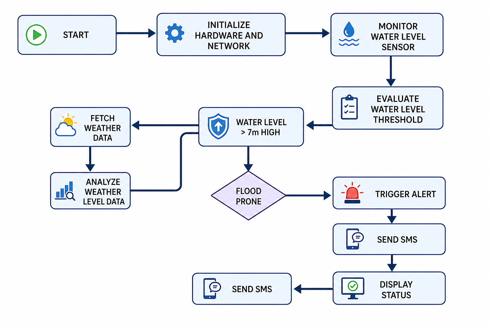

# IoT Flood Monitoring System

## Overview

The IoT Flood Monitoring System is an embedded and IoT-based solution designed to monitor real-time water levels and assess flood risk using sensor data and environmental conditions. The system integrates hardware sensing, embedded processing, and GSM-based communication to deliver timely flood alerts.

This project demonstrates practical implementation of IoT, embedded systems, and real-time monitoring for environmental safety applications.

---

## Key Features

* Real-time water level monitoring using ultrasonic sensor
* Threshold-based flood risk detection
* Integration of environmental/weather data (conceptual extension)
* GSM SMS alert system for emergency notifications
* Modular embedded system architecture
* Scalable design for smart disaster management systems

---

## System Architecture

The system is divided into three main layers:

* Sensing Layer: Captures water level data using ultrasonic sensor
* Processing Layer: Arduino / ESP32 processes and evaluates risk
* Communication Layer: GSM module sends alerts when thresholds are exceeded

### System Diagram


---

## System Workflow

The system follows this real-time decision flow:

1. Initialize all hardware components
2. Continuously read water level from ultrasonic sensor
3. Process and filter sensor data using microcontroller
4. Compare readings against safety threshold
5. Evaluate flood risk conditions
6. Trigger alert if danger is detected
7. Send SMS notification via GSM module
8. Log/update system status

### Flowchart



---

## Data Flow

* Sensor captures water level data
* Arduino processes raw measurements
* ESP32 handles communication logic
* System evaluates flood conditions
* GSM module sends emergency alert message

---

## Project Structure

```
iot-flood-monitoring-system/
├── arduino/        # Arduino code (sensor logic)
├── esp32/          # ESP32 communication logic
├── gsm/            # GSM SMS alert system
├── diagrams/       # System diagrams & flowcharts
│   ├── Schematics.png
│   └── Flowchart.png
└── README.md
```

---

## Technologies Used

* C / C++ (Arduino)
* ESP32 Microcontroller
* GSM A9G Module
* Ultrasonic Sensor (HC-SR04 or equivalent)
* Embedded Systems Design
* IoT Communication Concepts

---

## Setup Instructions

### Hardware Requirements

* Arduino-compatible board
* ESP32 module
* Ultrasonic sensor
* GSM A9G module
* Power supply

### Software Requirements

* Arduino IDE
* Serial Monitor

### Steps

1. Clone the repository

```
git clone https://github.com/Ogoti871/IOT-flood-monitoring-system.git
```

2. Open Arduino IDE
3. Upload code from /arduino or /esp32 folders
4. Connect hardware components as per schematic
5. Power system and monitor output

---

## Results

The system continuously monitors water levels and triggers SMS alerts when:

* Water level exceeds safe threshold
* Flood risk conditions are detected

---

## Future Improvements

* Cloud data logging and analytics
* Mobile application dashboard
* Machine learning-based flood prediction
* GPS-based location-specific alerts
* IoT cloud integration (MQTT / Firebase)

---

## Applications

* Flood early warning systems
* Smart city infrastructure
* Environmental monitoring systems
* Disaster risk management

---

## Author

Sam Ogoti

GitHub: [https://github.com/Ogoti871](https://github.com/Ogoti871)

---


